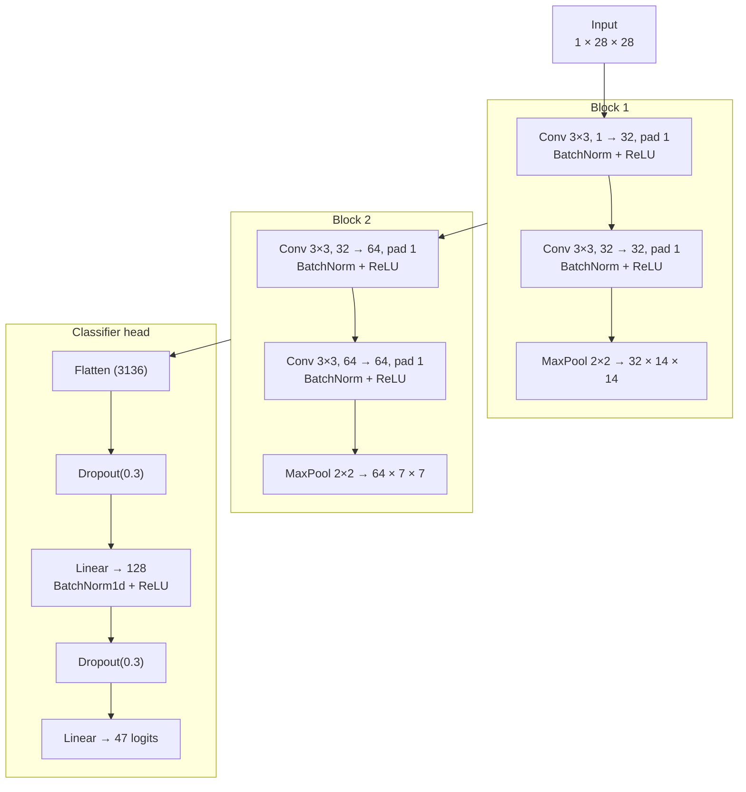
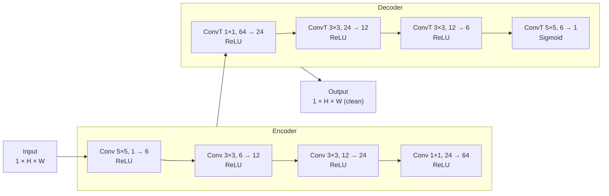

# Stage 1 — OCR Pipeline

End-to-end Optical Character Recognition for printed text. Takes a base64-encoded
image, cleans it up, finds every character, classifies each one, and returns the
recognized text plus per-character bounding boxes.

This stage is the **producer** for Stage 2 (Huffman compression) in the wider
`crisp` project — its `extracted_text` is what Stage 2 compresses.

---

## Table of contents

1. [High-level overview](#high-level-overview)
2. [Repository layout](#repository-layout)
3. [Pipeline](#pipeline)
4. [Recognition CNN](#recognition-cnn)
5. [Denoising autoencoder](#denoising-autoencoder)
6. [Setup](#setup)
7. [Usage](#usage)
   - [Run the API server](#run-the-api-server)
   - [Docker](#docker)
   - [Deploy to Google Cloud Run](#deploy-to-google-cloud-run)
   - [Retraining the models](#retraining-the-models)
   - [Standalone segmentation CLI](#standalone-segmentation-cli)
8. [API reference](#api-reference)
9. [Performance notes](#performance-notes)

---

## High-level overview

The service is a small FastAPI app that exposes a single `POST /ocr` endpoint.
Internally it runs three sequential models / algorithms:

```
base64 image
     │
     ▼
┌──────────────────────┐
│ 1. Denoise           │  Convolutional autoencoder
│    (NoisyOffice)     │  removes folds, stains, Gaussian / S&P noise
└──────────┬───────────┘
           ▼
┌──────────────────────┐
│ 2. Segment           │  Classical CV: Otsu binarization →
│    (lines/words/     │  horizontal projection → adaptive word gap →
│     characters)      │  connected components → wide-blob splitting
└──────────┬───────────┘
           ▼
┌──────────────────────┐
│ 3. Recognize         │  Small CNN (EMNIST `balanced`, 47 classes),
│    (per-character    │  hyper-parameters tuned with Optuna.
│     classification)  │
└──────────┬───────────┘
           ▼
   { extracted_text,
     denoised_image (base64),
     character_data: [{ bbox: [x, y, w, h] }, …] }
```

The denoiser and CNN weights live in `models/`; the segmentation step is purely
algorithmic and has no learned parameters.

---

## Repository layout

```
stage1_ocr/
├── main.py                         # FastAPI app (POST /ocr, GET /health)
├── pipeline.py                     # End-to-end ocr() function (denoise → segment → recognize)
├── requirements.txt
├── Dockerfile
├── models/
│   ├── denoising_autoencoder.pt    # ~46 KB
│   └── recognition_cnn.pt          # ~1.8 MB (state_dict + best Optuna params + label map)
├── denoising/
│   ├── train_denoising_autoencoder.ipynb
│   └── generate_noisy_images.py    # Adds Gaussian / salt-and-pepper noise to clean pages
└── segmentation/
    ├── segment_characters.py       # Importable + CLI character segmenter
    └── test_output/                # Sample box JSONs and overlay PNGs
```

The training data (NoisyOffice for the autoencoder, EMNIST `balanced` for the
CNN) is **not** committed. EMNIST is auto-downloaded by `torchvision`; for
NoisyOffice see [Retraining the models](#retraining-the-models).

---

## Pipeline

The whole pipeline lives in `pipeline.py::ocr()`. It is roughly:

1. `_decode_image` — base64 → grayscale `numpy` array.
2. `_denoise` — resize to `540 × 420`, run through the autoencoder, resize back to
   the original resolution. The autoencoder is fully convolutional so the only
   reason for the fixed input size is to match the training distribution.
3. `segment_image` (from `segmentation/segment_characters.py`) — produces a
   nested `{lines: [{words: [{chars: [{bbox}]}]}]}` structure.
4. `_recognize_words` — for each character bbox, crop, pad to a square with a
   white background, resize to `28×28`, invert (EMNIST is white-on-black, our
   input is the opposite), normalize, and batch through the CNN. Predictions
   are joined inside each word and words are space-separated.
5. The denoised image is re-encoded to base64 PNG and returned along with the
   flat list of character bboxes.

Models are loaded **lazily and cached** (`_denoiser_cache`, `_recog_cnn_cache`).
The first request after start-up is therefore slower than subsequent ones —
see [Performance notes](#performance-notes).

Device selection picks CUDA → MPS → CPU automatically.

### Segmentation in detail

`segment_characters.py` is fully classical (no ML). The steps are:

1. **Preprocess**: grayscale + 3×3 Gaussian blur.
2. **Binarize**: inverted Otsu so text pixels become `255`.
3. **Lines**: row ink-projection; runs above 5% of the max are line bands.
4. **Words**: column ink-projection per line; the cut-off between intra-word
   and inter-word gaps is found *adaptively* by sorting all zero-runs and
   picking the largest jump in width (`adaptive_word_gap`). This is robust to
   font and resolution without any tuning.
5. **Characters**: connected components per word, then any blob wider than
   ~`1.4 × median character width` is **split at the lowest points of a
   smoothed column profile** (`_split_wide_cc`). This handles touching glyphs
   that connected-components alone would merge.
6. The median character width is estimated globally across all lines so it
   does not get thrown off by tall ligatures or noise.

Outputs include the page width / height, the estimated `median_char_width`,
and the line / word / character bounding boxes.

---

## Recognition CNN

A small **VGG-style** network (`RecognitionCNN` in `pipeline.py` and
`recognition/train_recognition_cnn.ipynb`) trained on EMNIST `balanced` —
47 classes covering digits, uppercase letters, and the 11 lowercase letters
whose shape differs from their uppercase form. Channel widths, dropout, LR,
optimizer, scheduler, batch size, and label smoothing are tuned with **Optuna**
(20 trials, `MedianPruner`); the winning config is stored in the checkpoint so
`pipeline.py` rebuilds the exact architecture.

### Diagram



~440 K parameters, spatial path `28 → 14 → 7`.

### Design rationale

- **2 conv blocks, 4 conv layers.** Right capacity for `28×28` — deeper nets overfit.
- **3×3 kernels, `padding=1`.** Same `5×5` receptive field as one `5×5` conv with fewer params and an extra non-linearity; same-padding keeps the spatial path clean for two `2×` pools.
- **Channels 32 → 64, FC 128.** Standard "double after pool" rule, confirmed by Optuna.
- **BatchNorm + ReLU, `bias=False` before BN.** Stabilizes training; biases are redundant after BN.
- **MaxPool 2×2.** Cheaper than strided convs and fits stroke-presence features.
- **Dropout 0.3 around the FC + light affine aug.** Regularizes the parameter-dense head on ~2.4 K samples per class.
- **CE with class weights + label smoothing.** Portable across EMNIST splits; smoothing helps OCR look-alikes (`0/O`, `1/l/I`).

### Input handling at inference time

The segmenter returns crops of **dark ink on light background** but EMNIST is
**white-on-black**, so `_prepare_char_tensor` inverts the crop (`255 - x`)
before normalizing with the saved EMNIST mean/std. Crops are also padded to a
square *before* resizing to `28×28` (`_crop_and_pad_square`, 20% margin) —
otherwise narrow glyphs like `1`, `l`, `I`, and `i` would be stretched out of
shape.

### Training setup

| Item | Value |
| --- | --- |
| Dataset | EMNIST `balanced` (47 classes) |
| Train / Val / Test | 101,520 / 11,280 / 18,800 (90 / 10 split of EMNIST train, EMNIST test untouched) |
| Image size | 1 × 28 × 28, normalized with `mean=0.1307`, `std=0.3081` |
| Augmentation | Light affine jitter (train only) |
| Loss | Cross-entropy + class weights + label smoothing |
| Optimizer search | Adam / AdamW / SGD+momentum |
| Scheduler search | none / cosine |
| Tuning | Optuna TPE, 20 trials × 3 epochs on a 25K subset, `MedianPruner` (7 pruned, 13 completed) |
| Final training | 60 epochs on the full train set, best-val-acc checkpoint kept |
| Hardware time | ~54 min for the final 60-epoch retrain (CPU/MPS, batch 64) |

**Best Optuna config (used for the final retrain and shipped in `recognition_cnn.pt`):**

| Hyper-parameter | Value |
| --- | --- |
| `lr` | 0.00677 |
| `batch_size` | 64 |
| `optimizer` | `adamw` |
| `scheduler` | `cosine` |
| `dropout` | 0.103 |
| `label_smoothing` | 0.05 |
| `conv1_ch` | 48 |
| `conv2_ch` | 32 |
| `fc_dim` | 256 |
| Parameter count | **472,911** |

> Note: the best Optuna config (above) is what actually ships; the static
> diagram above (32 → 64, FC 128) is the default `RecognitionCNN()` constructor.

### Training & evaluation results

| Metric | Value |
| --- | --- |
| Best Optuna trial val accuracy (3-epoch tuning, 25K subset) | **0.8849** |
| Best validation accuracy (60-epoch final retrain) | **0.9106** |
| Final-epoch train / val accuracy | 0.9133 / 0.9096 |
| Final-epoch train / val loss | 0.6334 / 0.6209 |
| **Test accuracy (18,800 samples)** | **0.9057** |
| **Macro F1 (47 classes)** | **0.9048** |
| **Weighted F1** | **0.9048** |

**Where it does well vs. struggles** (per-class on the EMNIST test split, 400 samples per class):

| Class | Precision | Recall | F1 |
| --- | --- | --- | --- |
| `3` | 0.998 | 0.990 | 0.994 |
| `7` | 0.973 | 0.998 | 0.985 |
| `4` | 0.977 | 0.963 | 0.970 |
| `8` | 0.963 | 0.968 | 0.965 |
| `2` | 0.916 | 0.928 | 0.922 |
| `1` | 0.576 | 0.705 | 0.634 |
| `0` | 0.655 | 0.750 | 0.699 |
| `9` | 0.721 | 0.868 | 0.788 |
| `L` | 0.703 | 0.473 | 0.565 |
| `O` | 0.718 | 0.625 | 0.668 |
| `f` | 0.700 | 0.658 | 0.678 |
| `I` | 0.650 | 0.715 | 0.681 |
| `q` | 0.781 | 0.623 | 0.693 |
| `F` | 0.707 | 0.705 | 0.706 |
| `g` | 0.791 | 0.730 | 0.759 |

The pattern matches the [known weak spots](#performance-notes): the lowest
F1s are exactly the OCR look-alikes (`0/O`, `1/l/I`, `q/g`, `L`, `f/F`),
i.e. character pairs that look nearly identical even to a human at 28×28.
Pure digits `2`–`8` are essentially solved (F1 ≥ 0.92).

---

## Denoising autoencoder

A small **symmetric, fully-convolutional encoder–decoder** (`DenoisingAutoEncoder`
in `pipeline.py` and `denoising/train_denoising_autoencoder.ipynb`) trained on
NoisyOffice plus the synthetic Gaussian / salt-and-pepper variants produced by
`generate_noisy_images.py`. ~10 K parameters, trained with MSE + Adam for 30
epochs at `540 × 420`.

### Diagram



### Design rationale

- **Symmetric Conv / ConvTranspose pairs.** Output size matches input with no padding bookkeeping.
- **Channel ramp 1 → 6 → 12 → 24 → 64.** Wide bottleneck handles multiple noise types while staying ~10 K params — a good fit for the small NoisyOffice dataset.
- **5×5 at the edges, 3×3 in the middle, 1×1 at the bottleneck.** Wider context for large stains outside, cheap channel mixing at the centre.
- **ReLU hidden, Sigmoid output.** Output stays in `[0, 1]` to match the MSE target range.
- **No skip connections.** Kept small on purpose to avoid overfitting; U-Net skips are the natural next upgrade.

### Training setup

| Item | Value |
| --- | --- |
| Dataset | NoisyOffice (4 real noise types: coffee stains, folds, footprints, wrinkles) + synthetic Gaussian and salt-and-pepper from `generate_noisy_images.py` |
| Train / Val / Test pages | 108 noisy / 18 clean per split (each clean page paired with all 6 noise variants) |
| Image size | 1 × 540 × 420 grayscale, pixel values in `[0, 1]` |
| Loss | MSE between denoised output and the matching clean page |
| Optimizer | Adam (`lr=1e-3`, `weight_decay=1e-5`) |
| Epochs | 30 |
| Parameter count | **10,001** |

### Training & evaluation results

| Metric | Value |
| --- | --- |
| Final-epoch **train MSE** | **0.003598** |
| Final-epoch **validation MSE** | **0.003381** |
| **Test MSE** | **0.003313** |
| Wall-clock training time | ~2 min for 30 epochs (~4.2 s / epoch) |

Validation loss tracks training loss closely throughout (no visible
overfitting on the 18-page validation split), and test MSE actually comes
in *slightly* below validation MSE — an indication that the synthetic
Gaussian / salt-and-pepper augmentation generalizes well across the
NoisyOffice splits. Output quality is best judged visually in the
notebook's per-noise-type sample grid; numerically, an MSE of `~3.3e-3`
on `[0, 1]`-scaled grayscale corresponds to an average per-pixel error
of roughly `0.057` (~14 / 255).

> Only MSE is logged. PSNR / SSIM aren't computed in the current notebook —
> good candidates if the autoencoder gets a U-Net upgrade.

---

## Setup

Requires Python **3.10+**.

```bash
cd stage1_ocr
python -m venv .venv
source .venv/bin/activate    # Windows: .venv\Scripts\activate
pip install -r requirements.txt
```

The trained weights are committed under `models/`, so the API works out of the
box. If you want to retrain (next section), you also need the datasets.

---

## Usage

### Run the API server

```bash
cd stage1_ocr
uvicorn main:app --port 8000 --reload
```

Sanity check:

```bash
curl http://localhost:8000/health
# {"status":"ok"}
```

Send an image (replace `your_image.png`):

```bash
IMG_B64=$(base64 < your_image.png | tr -d '\n')
curl -s -X POST http://localhost:8000/ocr \
  -H "Content-Type: application/json" \
  -d "{\"image_base64\":\"$IMG_B64\"}" | jq '.extracted_text'
```

### Docker

```bash
cd stage1_ocr
docker build -t crisp-stage1 .
docker run --rm -p 8080:8080 crisp-stage1
# Or pick a different port:
# docker run --rm -e PORT=9000 -p 9000:9000 crisp-stage1
```

The container listens on `$PORT` (default `8080`, the Cloud Run convention).
The image is a multi-stage `python:3.11-slim` build that:

- installs **CPU-only** `torch` / `torchvision` from the PyTorch CPU index
  (the default PyPI wheels pull in the CUDA runtime — useless on Cloud Run
  and ~5× larger),
- swaps `opencv-python` for `opencv-python-headless` to avoid GUI deps,
- runs as a non-root `app` user.

Weights are copied in via `COPY . .`, so make sure `models/*.pt` exists locally
before building.

### Deploy to Google Cloud Run

```bash
cd stage1_ocr
export GCP_PROJECT_ID=my-gcp-project
./deploy_cloudrun.sh
```

The script builds with Cloud Build, pushes to Artifact Registry, and deploys
to Cloud Run. See the comments at the top of `deploy_cloudrun.sh` for one-time
setup (`gcloud auth login`, enabling APIs, creating the Artifact Registry repo)
and the env vars you can override (region, CPU/memory, scaling).

### Retraining the models

**Recognition CNN** (`recognition/train_recognition_cnn.ipynb`):

1. Open the notebook in Jupyter / VS Code.
2. Run top-to-bottom. EMNIST `balanced` will auto-download into
   `recognition/data/` on first run.
3. The notebook runs Optuna (`N_TRIALS = 20`, `TUNING_EPOCHS = 3`), then
   retrains for `FINAL_EPOCHS = 60` with the best params, evaluates on the
   test split, and writes
   `models/recognition_cnn.pt` containing
   `{model_state_dict, best_params, num_classes, label_map, img_size, mean, std, val_accuracy, test_accuracy}`.

**Denoising autoencoder** (`denoising/train_denoising_autoencoder.ipynb`):

1. Download the [NoisyOffice](https://archive.ics.uci.edu/dataset/216/noisyoffice)
   dataset and place its grayscale `clean` and `noisy` images under

   ```
   denoising/data/clean_images_grayscale/      # FontABC_Clean_{TR,VA,TE}.png
   denoising/data/simulated_noisy_images_grayscale/   # FontABC_NoiseX_{TR,VA,TE}.png
   ```

2. Generate the extra synthetic noise types (Gaussian + salt-and-pepper) so the
   model sees them at training time:

   ```bash
   cd stage1_ocr/denoising
   python generate_noisy_images.py
   # writes FontABC_Noiseg_*.png and FontABC_Noises_*.png next to the others
   ```

3. Run the notebook. It writes `models/denoising_autoencoder.pt` (a plain
   `state_dict`).

### Standalone segmentation CLI

The segmenter is also useful on its own — handy for debugging:

```bash
cd stage1_ocr/segmentation
python segment_characters.py --image my_page.png --out-dir ./out
# Done. lines=N, words=M, chars=K
#   JSON: out/my_page_boxes.json
#   VIZ : out/my_page_viz.png    <- red boxes overlaid on the original image
```

Sample outputs are committed in `segmentation/test_output/` — open
`*_viz.png` to see what good segmentation looks like.

---

## API reference

### `GET /health`

```json
{ "status": "ok" }
```

### `POST /ocr`

Request:

```json
{ "image_base64": "<PNG/JPEG bytes, base64-encoded>" }
```

Response (`200`):

```json
{
  "status": "success",
  "extracted_text": "the recognized text words space separated",
  "denoised_image": "<base64 PNG of the denoised image>",
  "character_data": [
    { "bbox": [x, y, w, h] },
    { "bbox": [x, y, w, h] }
  ]
}
```

`character_data` is a **flat** list of every character box in reading order
(line-major, then word-major, then left-to-right within each word). The bboxes
are in pixel coordinates of the **denoised** image (which has the same
resolution as the original input).

Errors:

| Status | Meaning |
| --- | --- |
| `400` | Missing or invalid `image_base64`. |
| `500` | Unexpected inference error. |
| `503` | One of the model `.pt` files is missing from `models/`. |

---

## Performance notes

- **Cold start.** The first request after server boot triggers model loading
  (and, on CUDA / MPS, kernel compilation). Send one warm-up request before
  benchmarking. This is also called out in the [project-level README](../README.md).
- **Device.** CUDA is preferred, then MPS (Apple Silicon), then CPU. Set
  via `pipeline.py::_pick_device`; nothing to configure manually.
- **Batching.** Recognition is batched at `batch_size=64` characters per
  forward pass, so a page with hundreds of characters is essentially one or
  two GPU calls.
- **Known weak spots.** Classic OCR look-alikes (`0/O`, `1/l/I`, `q/g`,
  `B/8`). Lowercase letters with the same shape as uppercase (`c, i, j, k, l,
  m, o, p, s, u, v, w, x, y, z`) are **merged into the uppercase class** by
  EMNIST `balanced` — recognized text will therefore be uppercase for those
  letters. Switch the training split to `byclass` if you need true case
  sensitivity.
